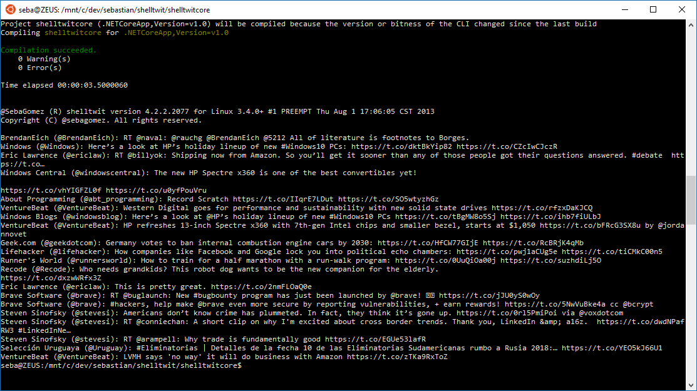

shelltwit
=========

[](https://gitter.im/sebagomez/shelltwit?utm_source=badge&utm_medium=badge&utm_campaign=pr-badge&utm_content=badge)
[](https://ci.appveyor.com/project/sebagomez/shelltwit)
[](https://travis-ci.org/sebagomez/shelltwit)

shelltwit allows you to update your twitter status via command line.   
It's a good example of twitter API calls with xAuth. It also has bit.ly integration for url shortening.




Little more (?) info about it at the original [blog post](http://sgomez.blogspot.com/2010/06/introducing-shelltwit.html)

Implemented Twitter APIs
------------------------
- [Status Update](https://dev.twitter.com/rest/reference/post/statuses/update)
- [Status Mentions](https://dev.twitter.com/rest/reference/get/statuses/mentions_timeline)
- [Status Home Timeline](https://dev.twitter.com/rest/reference/get/statuses/home_timeline)
- [Status User Timeline](https://dev.twitter.com/rest/reference/get/statuses/user_timeline)
- [Search](https://dev.twitter.com/rest/public/search)
- [Favorites List](https://dev.twitter.com/rest/reference/get/favorites/list)
- [Streaming statuses](https://dev.twitter.com/streaming/reference/post/statuses/filter)

Build
-----
After downloading the source files build the sln with Visual Studio 2015 (framework 4.6)

There's also a [.net core](https://www.microsoft.com/net/core#windows) solution called [shelltwitcore.sln](shelltwitcore.sln) (figures). You can also open that up with Visual Studio 2015 or go straight to the shelltwitcore folder and work with [Visual Studio Code](https://code.visualstudio.com/) from there. 
In order to build the .net core project you need to run the [build.bat](./shelltwitcore/build.bat) file first which basically copies the source files from the other projects into this one. (for some reason assing linked files in .xproj projects does not work)
This build has been tested on Ubuntu [WSL](https://en.wikipedia.org/wiki/Windows_Subsystem_for_Linux), and it [works on my machine](https://blog.codinghorror.com/the-works-on-my-machine-certification-program/) .

```
@SebaGomez (R) shelltwit version 5.0.0.31862 for Microsoft Windows 10.0.14393
Copyright (C) @sebagomez. All rights reserved.

Usage: twit /q <query>|/c|/tl|/m|/l|/s <track>|/u <user>|/?|<status> [<mediaPath>]

/c              : clears user stored credentials
/tl             : show user's timeline (default)
/q              : query twits containing words
/m              : show user's mentions
/u user         : show another user's timeline
/s track        : live status with a specific track
/l              : user's likes (fka favorites)
/?              : show this help
status          : status to update at twitter.com
mediaPath       : full path, between brackets, to the media files (up to four) to upload.
```